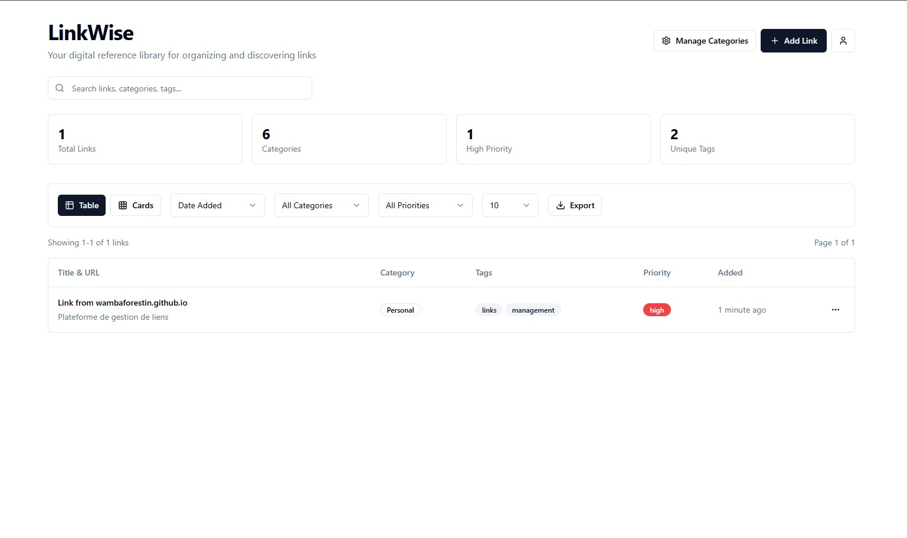

# LinkWise

<p align="center">
  
</p>

<p align="center">
  <strong>Your digital reference library for organizing and discovering links</strong>
</p>

<p align="center">
  
</p>

---

## 🌟 Overview

LinkWise is a modern, intuitive web application designed to help you organize, categorize, and discover your digital links efficiently. Built with cutting-edge web technologies, it provides a seamless experience for managing your digital reference library.

## ✨ Key Features

### 📊 **Smart Organization**
- **Advanced Categorization**: Organize links with custom categories and tags
- **Priority Management**: Mark important links with priority levels (High, Medium, Low)
- **Intelligent Search**: Find links quickly with our powerful search functionality

### 📈 **Analytics & Insights**
- **Dashboard Overview**: Get insights into your link collection at a glance
- **Usage Statistics**: Track your most accessed categories and links
- **Visual Analytics**: Beautiful charts and metrics to understand your data

### 🎨 **Modern Interface**
- **Dual View Modes**: Switch between table and card layouts
- **Responsive Design**: Works perfectly on desktop, tablet, and mobile devices
- **Export Capabilities**: Export your data in JSON and CSV formats
- **Advanced Pagination**: Navigate through large collections effortlessly

### 🔐 **Secure & Reliable**
- **User Authentication**: Secure login and user management
- **Data Persistence**: All your links are safely stored and backed up
- **Real-time Updates**: Changes are reflected instantly across sessions

## 🚀 Quick Start

### Prerequisites
- Node.js (v16 or higher)
- npm or yarn package manager

### Installation

1. **Clone the repository**
   ```bash
   git clone https://github.com/your-username/linkwise-knowledge-nest.git
   cd linkwise-knowledge-nest
   ```

2. **Install dependencies**
   ```bash
   npm install
   # or
   yarn install
   ```

3. **Start the development server**
   ```bash
   npm run dev
   # or
   yarn dev
   ```

4. **Open your browser**
   Navigate to `http://localhost:5173` to start using LinkWise

## 🛠️ Tech Stack

LinkWise is built with modern, industry-standard technologies:

### Frontend
- **React 18** - Modern UI library with hooks and concurrent features
- **TypeScript** - Type-safe JavaScript for better development experience
- **Vite** - Lightning-fast build tool and development server
- **Tailwind CSS** - Utility-first CSS framework for rapid UI development

### UI Components
- **Shadcn/UI** - Beautiful, accessible component library
- **Lucide React** - Comprehensive icon library
- **Recharts** - Responsive chart library for data visualization

### Backend & Database
- **Supabase** - Open source Firebase alternative
  - Real-time database
  - Authentication
  - Row Level Security (RLS)
  - RESTful APIs

### State Management & Data Fetching
- **TanStack Query** - Powerful data synchronization for React
- **React Hook Form** - Performant forms with easy validation

## 🔧 Configuration

### Environment Variables
Create a `.env.local` file in the root directory:

```env
VITE_SUPABASE_URL=your_supabase_url
VITE_SUPABASE_ANON_KEY=your_supabase_anon_key
```

### Customization
LinkWise is highly customizable. You can modify:
- Color schemes in `tailwind.config.ts`
- Default categories in `src/constants/categories.ts`
- Component styles in respective component files


## 📄 License

This project is licensed under the MIT License - see the [LICENSE](LICENSE) file for details.

## 🙏 Acknowledgments

- Built with [Lovable](https://lovable.dev) - AI-powered web development
- Icons by [Lucide](https://lucide.dev)
- UI components from [Shadcn/UI](https://ui.shadcn.com)
- Database and auth by [Supabase](https://supabase.com)

---

<p align="center">
  Made with ❤️ using modern web technologies
</p>
